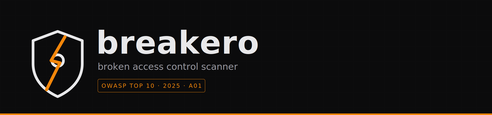
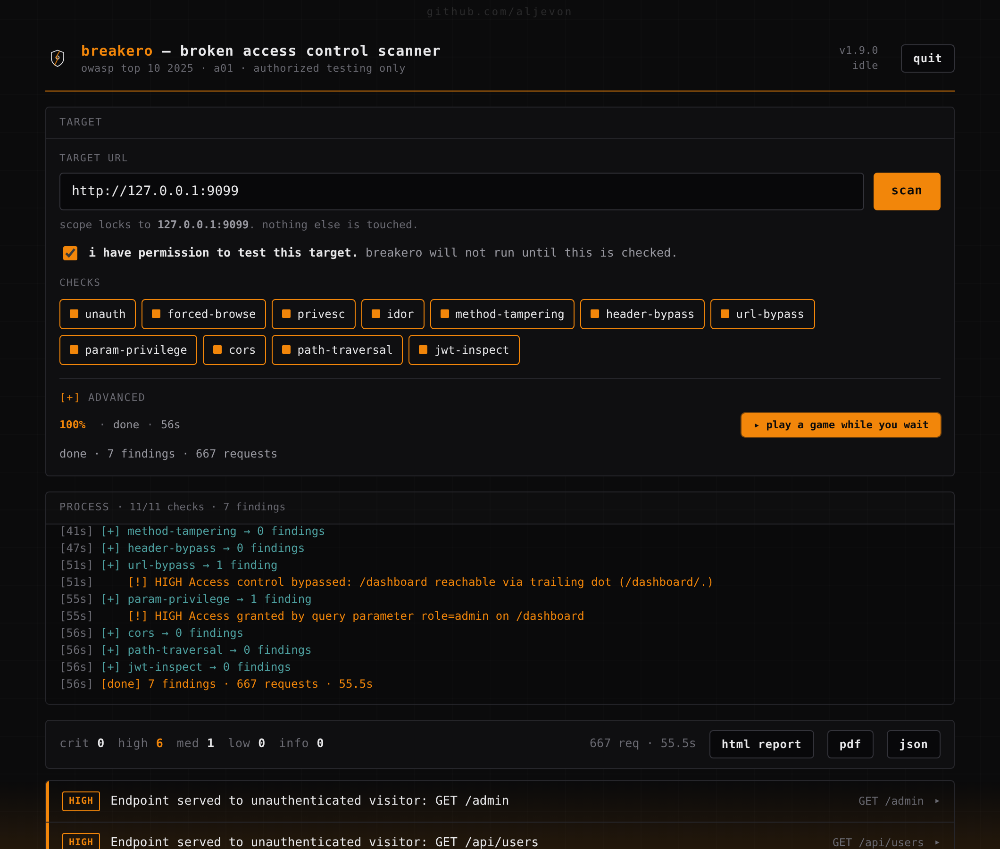
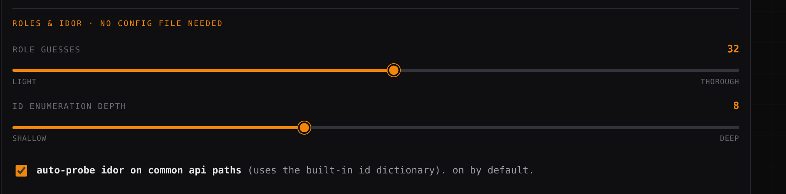
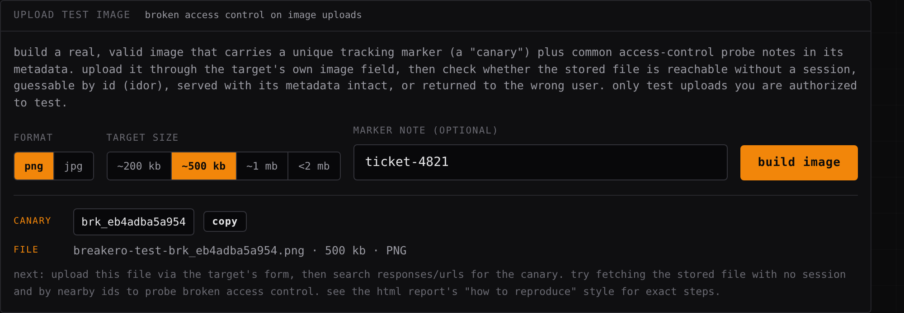
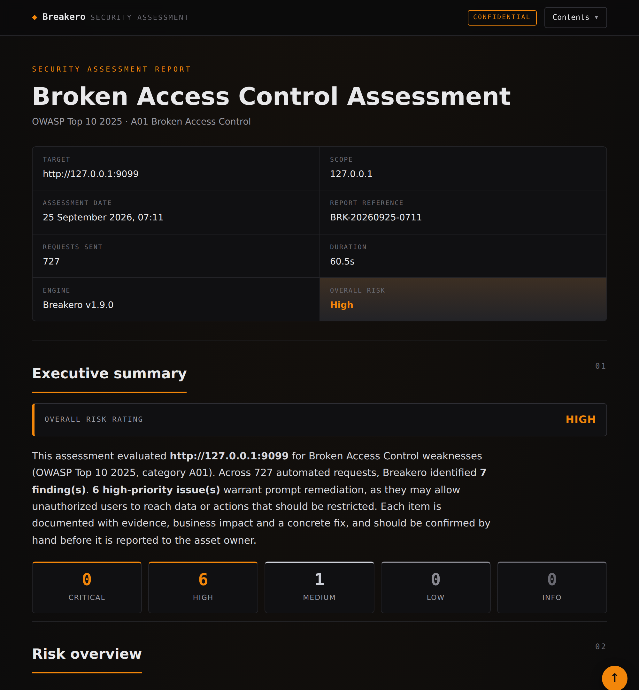
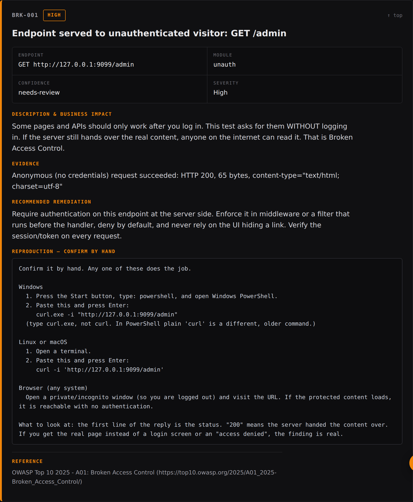

<div align="center">



<p><em>A small, quick scanner for broken access control. That's category A01 in the OWASP Top 10 for 2025, and it sits right at the top of the list.</em></p>

<p>
  <a href="#quick-start"></a>
  <a href="AUTHORIZATION.md"></a>
</p>

<p>
  
  
  
  
  
</p>

</div>

---

Breakero looks for one kind of bug: spots where a web app or API hands you something it shouldn't. An admin page that opens with no login. Somebody else's account when you change an id in the URL. A delete endpoint nobody got around to protecting. That whole family of problems is called broken access control, and honestly it's everywhere.

The idea was to make something a beginner can actually run without a wiki open in another tab. So every finding tells you what it hit, why that matters, and how a developer would go about fixing it, in plain words. If you've done this a hundred times already, run it quiet and take the JSON.

> [!IMPORTANT]
> Only point this at things you own or have written permission to test. In most countries, prodding someone else's site without that permission is a crime, full stop. Breakero won't even start until you tell it you're allowed, and it refuses to send a single request to any host you didn't put in scope. Have a look at [`AUTHORIZATION.md`](AUTHORIZATION.md) before your first run.

## The app

Double-click the download and Breakero opens in its own window: no tabs, no address bar, just the app. Type a URL, tick the box that says you're allowed to test it, hit Scan. Results show up as you go, each one with a plain explanation and how to fix it. No install, no terminal, no digging through folders. Works this way on Windows, macOS and Linux.

On Windows it's a real native desktop window: its own process and taskbar entry, drawn with the WebView2 runtime that ships with Windows 10 and 11. No browser, no chrome around it. On macOS and Linux it opens a dedicated app-mode window using Chrome, Chromium, Edge or Brave. If none of that is available it falls back to your default browser, so it always opens one way or another. Under the hood it's a tiny local server that only your own machine can reach.

<div align="center">
  
</div>

While a scan runs you get a live progress readout (percent done, time left, elapsed) and a process panel that streams every check and finding as it happens, like a terminal. Long scan? There's a small flappy-shield mini-game you can open and close whenever you like. When it's done, the results come with three buttons: a full **HTML report**, a **PDF** (via the print dialog), and **JSON**.

Prefer the command line? That still works too, same engine underneath. See [Quick start](#quick-start).

---

## Contents

- [What's good about it](#whats-good-about-it)
- [Staying out of trouble](#staying-out-of-trouble)
- [Install](#install)
- [Quick start](#quick-start)
- [What it checks](#what-it-checks)
- [Roles and IDOR, no config needed](#roles-and-idor-no-config-needed)
- [Upload test images](#upload-test-images)
- [Sample report](#sample-report)
- [Config file](#config-file)
- [Flags](#flags)
- [Reading the results](#reading-the-results)
- [Somewhere safe to practice](#somewhere-safe-to-practice)
- [Build it yourself](#build-it-yourself)
- [How the code is laid out](#how-the-code-is-laid-out)
- [License](#license)

---

## What's good about it

- **It's one file.** No Python, no Node, nothing to install first. Download it and go. Cold start is basically instant.
- **No config file to find IDOR or role bugs.** A large built-in dictionary of role and permission values, object-id parameters and common REST id paths means IDOR and privilege checks work the moment you press Scan. Two sliders in the app tune how deep it goes.
- **It explains itself.** Type `breakero -explain` and it talks you through every check in normal language. The HTML report opens with a short intro for people who are new to this.
- **Hard to misuse.** There's a speed limit, a cap on total requests, a scope lock, and it stays read-only until you say otherwise. You won't knock a site over by accident.
- **Reports you can hand to someone.** A professional, enterprise-style HTML report with a cover, an executive summary and a jump-to contents menu; the same thing as a **PDF**; color in the terminal; and JSON if you'd rather script around it.
- **Cross-check by hand.** Every finding comes with a curl command (Windows, Linux, macOS) and a browser step, so you can reproduce it yourself before you report it.
- **Test file uploads too.** Build a valid PNG or JPG of a chosen size, carrying a unique marker, to probe broken access control on image-upload features.
- **Less noise.** Plenty of scanners scream about every path they guess. This one notices when a server answers "200 OK" to things that don't exist and quiets down.

## Staying out of trouble

None of this is on the honor system. The code enforces it.

| Control | What it actually does |
|---|---|
| **Authorization gate** | It won't run until you pass `-i-am-authorized` (or set `authorized: true`). That's you saying you have permission. |
| **Scope lock** | Every request gets checked against your list of allowed hosts. Anything else gets dropped before it's sent, including a redirect that would wander off scope. |
| **Speed limit** | Requests go out slowly, about 5 a second unless you change it. It's a testing tool, not a flooder, and you can't really turn it into one. |
| **Request cap** | A hard ceiling on total requests (2000 by default) so a run can't run away from you. |
| **Read-only unless you say so** | POST, PUT, PATCH and DELETE stay off until you add `-active`. |

## Install

### Grab a prebuilt binary

Pick the file for your machine on the [**Releases**](../../releases) page:

| System | File |
|---|---|
| Windows (64-bit) | `breakero-windows-amd64.exe` |
| Linux (64-bit) | `breakero-linux-amd64` |
| macOS (64-bit) | `breakero-darwin-amd64` |

Three files, one per system. On an Apple Silicon Mac (M1/M2/M3) the macOS build runs through Rosetta; macOS installs it the first time you need it.

Windows, from PowerShell in your downloads folder:

```powershell
.\breakero-windows-amd64.exe -version
```

Or skip the terminal entirely: **double-click the exe** and the app opens in your browser. No console window, nothing to install, nothing copied to hidden folders. The exe carries the Breakero icon so it's easy to spot. On macOS and Linux it's the same idea, run the binary with no arguments (or `breakero -gui`) and the app opens.

Linux or macOS, mark it runnable first:

```bash
chmod +x breakero-linux-amd64
./breakero-linux-amd64 -version
```

### Or build it

Go 1.24 or newer is all you need. Jump to [Build it yourself](#build-it-yourself).

## Quick start

Just want the app? Run it with no arguments, or:

```bash
breakero -gui
```

For the command line, a basic run. The `-i-am-authorized` flag is you confirming you're allowed to test this target:

```bash
breakero -url https://your-target.example -i-am-authorized -html report.html
```

Not sure what each check does? Ask it:

```bash
breakero -explain
```

Scan while logged in, so it can check what one account can reach that another can't:

```bash
breakero -url https://your-target.example -i-am-authorized \
  -cookie "session=YOUR_SESSION_COOKIE"
```

Bigger job with several roles and a list of endpoints, driven by a config file:

```bash
breakero -config configs/example.json
```

## What it checks

Eleven modules, each one aimed at a real broken-access-control pattern from A01:2025 (and drawn from sources like the PortSwigger Web Security Academy). Run `breakero -list-checks` for the short ids, or `-explain` for the friendly version.

| Module (`id`) | What it's hunting for |
|---|---|
| `unauth` | Pages and APIs that serve real content with nobody logged in |
| `forced-browse` | Guessing the address of hidden stuff (admin, config, `.git`, actuator), plus paths the site leaks in robots.txt and sitemap.xml |
| `privesc` | A low-privilege account reaching something only an admin should touch |
| `idor` | Reading another user's object by swapping the `id` (IDOR / BOLA) |
| `method-tampering` | A rule that guards GET but forgot about HEAD, PUT or DELETE |
| `header-bypass` | Walking past a block with a trusted header like `X-Forwarded-For`, `Referer` or `X-Original-URL` |
| `url-bypass` | Reaching a blocked path a different way: `/admin/`, `/ADMIN`, `/admin%2f`, `/admin..;/`, a rewrite header |
| `param-privilege` | Access decided by something you send: `?admin=true`, `X-User-Role: admin`, an `isAdmin` cookie |
| `cors` | A CORS setup that reflects any origin and allows credentials too |
| `path-traversal` | Reaching files outside the intended folder, `../../etc/passwd` style. Detection only |
| `jwt-inspect` | Weak tokens: `alg=none`, no expiry, a role claim the client could edit |

Everything goes through one shared HTTP client, and that client is where scope, the speed limit and the request cap live. No module gets to skip them.

## Roles and IDOR, no config needed

IDOR and privilege problems used to need a hand-written config describing which role holds which login and which objects belong to whom. Now that knowledge is built in. Breakero ships with a large dictionary of role and permission values (admin, manager, editor, staff, moderator, superadmin and dozens more), common object-id parameters (`id`, `user_id`, `order_id`, `file`…) and REST id paths (`/api/users/{id}`, `/account/{id}`…). It guesses privilege on blocked pages and walks sequential ids on common API paths automatically, so you get real IDOR and role coverage from a pasted URL.

Two elegant sliders in the app's Advanced panel tune it, no file to edit:

- **role guesses** — how many role/permission values to try on each blocked page, from light to thorough.
- **id enumeration depth** — how many neighbouring ids the automatic IDOR probe reads, from shallow to deep.
- **auto-probe idor on common api paths** — on by default.

<div align="center">
  
</div>

The defaults are tuned so a beginner just presses Scan. A [config file](#config-file) is still there for the deeper case, where you want to test as specific logged-in accounts and compare them.

## Upload test images

Some access-control bugs live in the upload path: a stored image reachable with no session, guessable by id, or served to the wrong user. The app builds a real, valid PNG or JPG of about the size you pick (~200 KB, ~500 KB, ~1 MB or under 2 MB) with a unique tracking marker (a "canary") embedded in the file's metadata. Upload it through the target's own image field, then use the canary to see how the stored file is handled. Nothing is uploaded for you; it only writes a local file, so you stay in control of the request.

<div align="center">
  
</div>

## Sample report

The HTML report is a single self-contained file, laid out like a professional security-assessment document: a cover with an overall risk rating and a report reference, an executive summary, a risk overview, a navigable findings index, and detailed findings with evidence, business impact and a copy-ready reproduction step. A fixed **Contents** dropdown jumps to any section, so a long report is never a long scroll. Save it as HTML to email or drop into a ticket, or as **PDF** straight from the app.

<div align="center">
  
  <br><br>
  
</div>

## Config file

You do not need a config file to find IDOR and privilege problems. Out of the box the app carries a large built-in dictionary of role and permission values (admin, manager, editor, staff, and dozens more) and common object-id parameters and REST id paths (`/api/users/{id}`, `?id=`, and so on). It guesses privilege on blocked pages and walks sequential ids on common API paths automatically. Two controls in the app's Advanced panel tune this without touching any file:

- **role guesses** — how many role/permission values to try on blocked pages. A slider, from light to thorough.
- **id enumeration depth** — how many neighbouring ids the automatic IDOR probe reads. A slider, from shallow to deep.
- **auto-probe idor on common api paths** — on by default.

A config file is only for the deeper case, where you want to test as specific logged-in accounts and compare them. It lets Breakero know which role holds which login, and which objects belong to whom. The full example is [`configs/example.json`](configs/example.json). The gist:

```json
{
  "authorized": true,
  "base_url": "https://app.example.com",
  "scope_include": ["app.example.com", "*.api.example.com"],
  "rate_per_second": 5,
  "max_requests": 3000,
  "roles": [
    { "name": "anonymous", "level": 0 },
    { "name": "alice", "level": 10, "cookie": "session=...", "owned_ids": ["1001"] },
    { "name": "bob",   "level": 10, "cookie": "session=...", "owned_ids": ["1002"] },
    { "name": "admin", "level": 100, "cookie": "session=..." }
  ],
  "endpoints": [
    { "path": "/admin",          "method": "GET", "min_role": "admin", "sensitive": true },
    { "path": "/api/v1/account", "method": "GET", "min_role": "alice", "id_param": "id" },
    { "path": "/download",       "method": "GET", "id_param": "file" }
  ]
}
```

A few fields worth explaining:

- `level` is how much power a role has. Bigger number, more power. 0 means anonymous.
- `owned_ids` are the object ids that legitimately belong to a role. That's how the cross-user test knows whose data it's poking at.
- `id_param` names the parameter that carries an object reference for IDOR, or you can drop a `{id}` placeholder in the path. Name a param something like `file` or `path` and the traversal check will pick it up too.
- `min_role` is the lowest role that's supposed to be allowed in. The privilege-escalation check uses it.

## Flags

| Flag | What it does |
|---|---|
| `-url` | Target base URL |
| `-i-am-authorized` | Required. You confirming you're allowed to test |
| `-config` | Path to a JSON config file |
| `-cookie` | Cookie for a quick logged-in scan |
| `-header` | Extra header `Name: Value` (chain several with `;;`) |
| `-checks` | Only run certain modules, e.g. `unauth,cors` |
| `-scope` / `-exclude` | Add or drop in-scope hosts (`*.example.com` works) |
| `-rate` | Requests per second (default 5) |
| `-max-requests` | Total request cap (default 2000) |
| `-active` | Allow POST/PUT/PATCH/DELETE. Think before you use it |
| `-html` / `-json` | Write a report to a file |
| `-explain` | Talk through each module. Good for learning |
| `-list-checks` | Print the module ids |
| `-gui` | Open the app (graphical UI in your browser) |

`breakero -h` has the rest.

## Reading the results

Every finding carries a severity (CRITICAL down to INFO) and a confidence:

- `confirmed` means it's real. A traversal payload that actually returned file contents, say.
- `likely` means the comparison backs it up pretty strongly.
- `needs-review` means go check it by hand. Odd apps fool automated tools, so confirm before you write it up.

There's also a soft-404 step at the start. If the server answers "200 OK" with a page for URLs that don't exist, Breakero spots that and stops flagging every guessed path. Cuts the false positives way down.

One thing to keep in mind: "no findings" doesn't mean the target is safe. It means these particular checks didn't fire. Treat this as a first pass, not the whole job. Real testing still needs a human poking at the business logic.

## Somewhere safe to practice

No target you're cleared to test yet? Spin up something built to be broken on purpose and go wild:

- [OWASP Juice Shop](https://owasp.org/www-project-juice-shop/)
- [PortSwigger Web Security Academy](https://portswigger.net/web-security)
- [DVWA, the Damn Vulnerable Web Application](https://github.com/digininja/DVWA)

## Build it yourself

You just need [Go 1.24+](https://go.dev/dl/).

```bash
# Linux / macOS: build every platform into ./dist
./build.sh

# Windows (PowerShell)
powershell -ExecutionPolicy Bypass -File .\build.ps1

# or with make
make release      # every platform
make build        # just your machine
make test         # run the tests
```

## How the code is laid out

```
cmd/breakero        the CLI itself
internal/checks     the A01 test modules
internal/httpx      HTTP client with scope, speed limit and the request cap
internal/scope      the host-boundary guard
internal/engine     runs the checks, plus the soft-404 step
internal/webui      the app: local server and the embedded UI
internal/report     terminal, HTML and JSON output
internal/config     config loading and the authorization gate
internal/finding    the finding model and severities
```

## License

MIT. See [`LICENSE`](LICENSE). Use it on things you're allowed to use it on.

<div align="center"><sub>Breakero · a Broken Access Control scanner · OWASP Top 10 2025, A01</sub></div>
